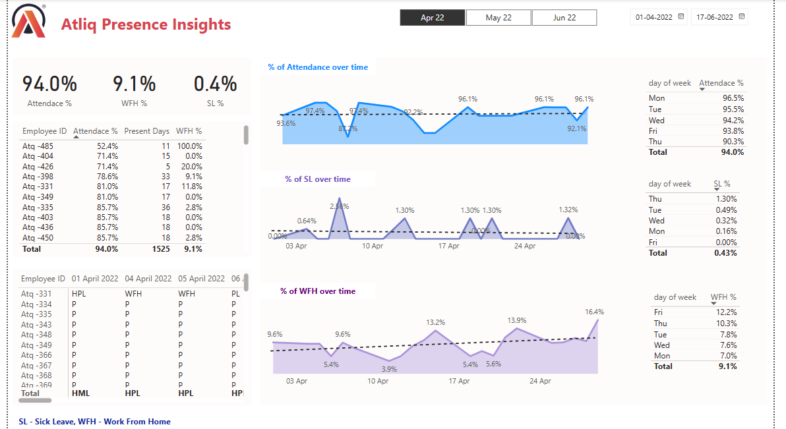

# HR_DataAnalytics
# 📊 HR Analytics Dashboard - Atliq 

This project presents an **HR Analytics Dashboard** built in **Power BI** using masked employee data from **Atliq Corp**. The dashboard helps HR professionals analyze workforce data such as employee distribution, attrition rates, department performance, and key HR KPIs for strategic decision-making.

---

## 📁 File Info

- **File Name**: `HR Analytics Atliq_masked.pbix`
- **Tool Used**: Microsoft Power BI
- **Dataset Type**: Masked (Privacy Preserved)
- **Project Goal**: To provide interactive insights into HR operations

---

## 🎯 Key Insights

- 👥 **Employee Count** by Department, Gender, and Region
- 🔁 **Attrition Analysis** by Age, Experience, and Performance
- 🧠 **Skill & Education Breakdown** of Employees
- 📈 **Trend Analysis** for hiring and attrition
- 📌 **Interactive Filtering** using slicers and charts

---

## 📷 Dashboard Preview

